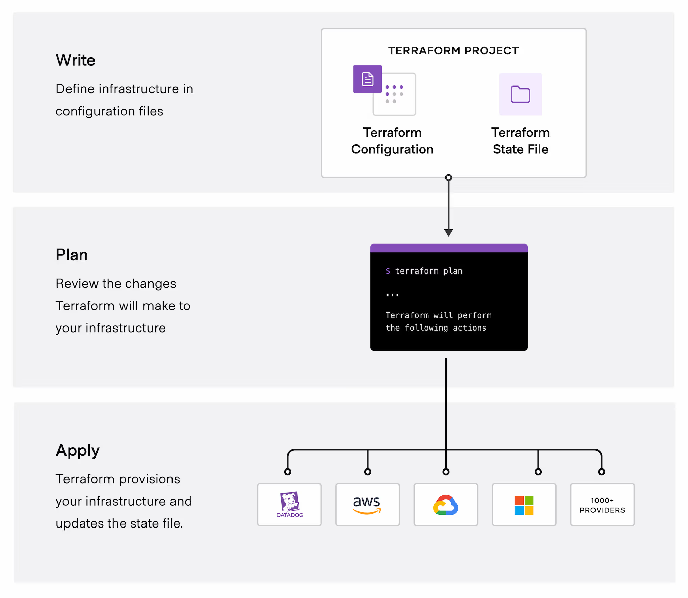

# Terraform

#

- AWS introduce CLOUDFORMATION in 2011.
- AWS CloudFormation is an Infrastructure as Code (IaC) service that allows you to define and provision AWS resources using templates. These templates are written in JSON or YAML and can automate the creation, update, and deletion of AWS infrastructure in a repeatable and consistent manner.
  Key Features of CloudFormation:

1. Infrastructure as Code – Define your AWS infrastructure in a declarative template.
2. Automated Resource Management – Create, update, and delete resources automatically.
3. Stack Management – Group related resources into a single unit (stack).
4. Rollback and Change Sets – Preview changes before applying them and rollback failed deployments.
5. Cross-Region & Cross-Account Deployment – Deploy infrastructure across multiple AWS accounts and regions.

## Example CloudFormation Template (YAML)

This template provisions an S3 bucket:

```
AWSTemplateFormatVersion: '2010-09-09'
Resources:
  MyS3Bucket:
    Type: AWS::S3::Bucket
    Properties:
      BucketName: my-cloudformation-bucket

```

## Common Use Cases:

- Automating AWS resource provisioning
- Enforcing best practices using predefined templates
- Managing infrastructure across multiple environments (dev, staging, prod)

#

# Mictell Hashimoto introduces Terraform in July 2014.

## Terraform name derived fro "Extra Terrestril Activity "

## Meaning of name Terraform - It makes your planet just like earth.

#

# Terraform

- HashiCorp Terraform is an infrastructure as code tool that lets you define both cloud and on-prem resources in human-readable configuration files that you can version, reuse, and share.
- You can then use a consistent workflow to provision and manage all of your infrastructure throughout its lifecycle.
- Terraform can manage low-level components like compute, storage, and networking resources, as well as high-level components like DNS entries and SaaS features.

## How does Terraform work?

- Terraform creates and manages resources on cloud platforms and other services through their application programming interfaces (APIs).
- Providers enable Terraform to work with virtually any platform or service with an accessible API.
  
- - HashiCorp and the Terraform community have already written thousands of providers to manage many different types of resources and services. You can find all publicly available providers on the Terraform Registry, including Amazon Web Services (AWS), Azure, Google Cloud Platform (GCP), Kubernetes, Helm, GitHub, Splunk, DataDog, and many more.

## The core Terraform workflow consists of three stages:

- <mark>write</mark>: You define resources which may be across multiple cloud providers and services.
  For example, you might create a configuration to deploy an application on virtual machines in a <mark>virtual private cloud(VPC)</mark> network with security group and loadbalancer.
- <mark>plan</mark>: Terraform creates an execution plan describing the infrastructure it will create, update, or destroy based on existing infrastructure and your configuration.
- <mark>apply</mark>: On approval, Terraform perform the proposed operations in the correct order, respecting any resource dependencies. For example, If you update the properties of the VPC and change the number of virtual machines in that VPC, Terraform will recreate the VPC before scaling the virtual machines.
  

## Why Terraform?

### Manage any infrastructure

- Find providers for many of the platforms and services you already use in the [Terraform Registry](https://registry.terraform.io/?product_intent=terraform).
- You can also [write your own plugin](https://developer.hashicorp.com/terraform/plugin)
- Terraform takes an [immutable approach to infrastructure](https://www.hashicorp.com/resources/what-is-mutable-vs-immutable-infrastructure), reducing the complexity of upgrading or modifying your services and infrastructure.

## Track your infrastructure

- Terraform generates a plan and prompts you for your approval before modifying your infrastructure.
- It also keeps track of your real infrastructure in a [state file](https://developer.hashicorp.com/terraform/language/state) , which acts as a source of truth for your environment.
- Terraform uses the state file to determine the changes to make to your infrastructure so that it will match your configuration.

## Automate changes

- Terraform configuration files are declarative, meaning that they describe the end state of your infrastructure.
- You do not need to write step-by-step instructions to create resources because Terraform handles the underlying logic.
- Terraform builds a resource graph to determine resource dependencies and creates or modifies non-dependent resources in parallel. This allows Terraform to provision resources efficiently.

## Standardize configurations

- Terraform supports reusable configuration components called [modules](https://developer.hashicorp.com/terraform/language/modules) that define configurable collections of infrastructure, saving time and encouraging best practices.
- You can use publicly available modules from the Terraform Registry, or write your own.

## Collaborate

- Since your configuration is written in a file, you can commit it to a Version Control System (VCS) and use [HCP](https://developer.hashicorp.com/terraform/intro/terraform-editions#hcp-terraform)Terraform to efficiently manage Terraform workflows across teams.
- HCP Terraform runs Terraform in a consistent, reliable environment and provides secure access to shared state and secret data, role-based access controls, a private registry for sharing both modules and providers, and more.

#

### Tip: Learn more about [Terraform use cases](https://developer.hashicorp.com/terraform/intro/use-cases) and [how Terraform compares to altenatives](https://developer.hashicorp.com/terraform/intro/vs).
